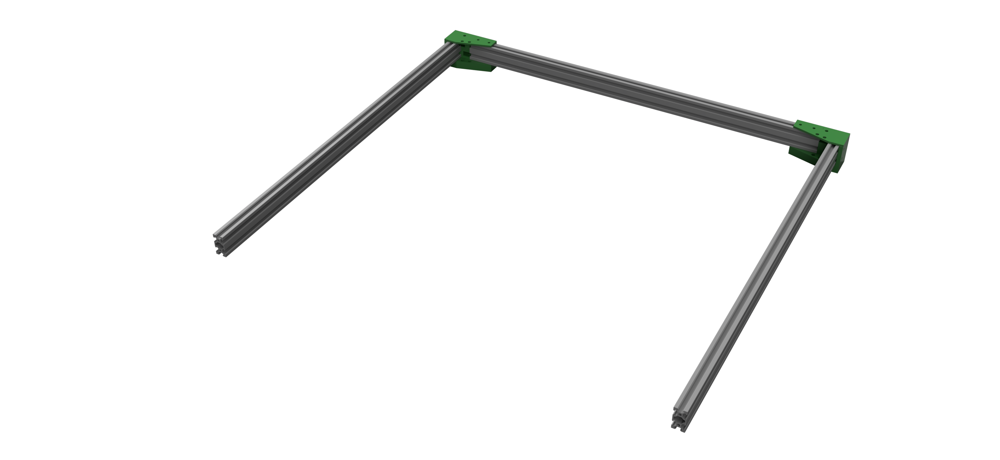
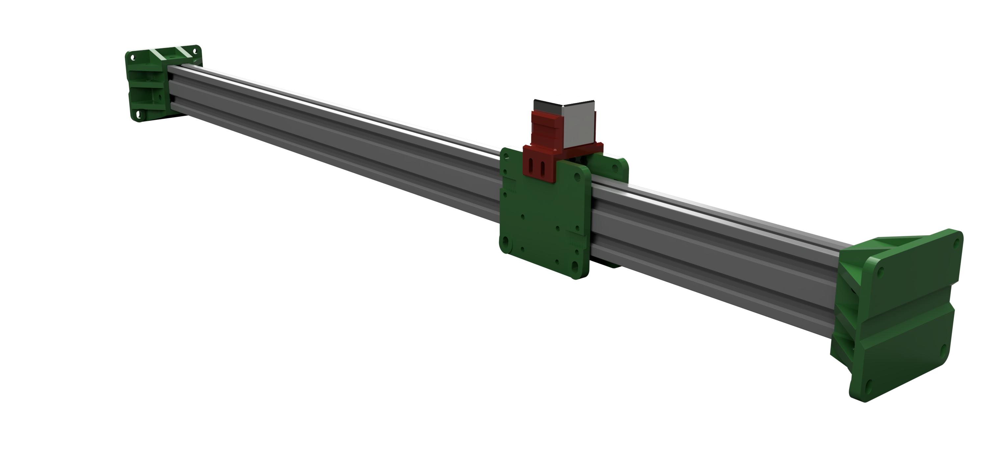
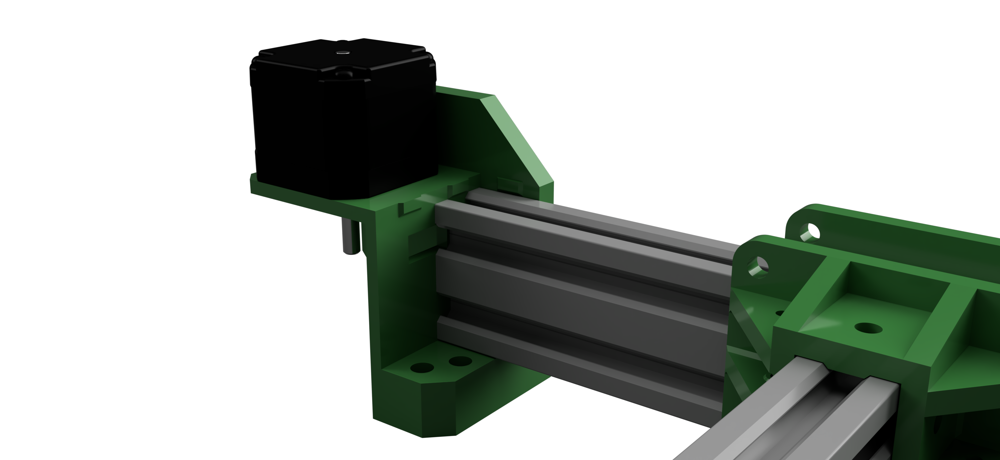
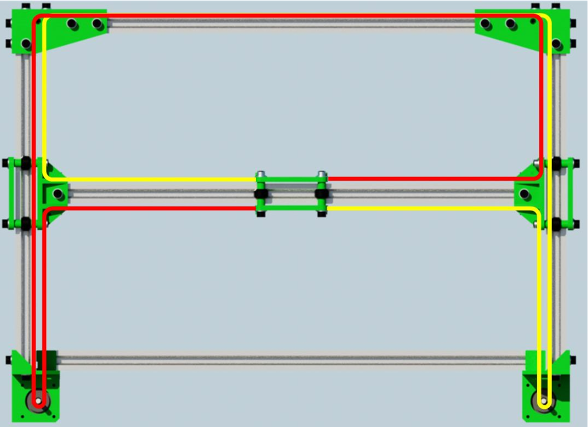

# Sand Table Build Guide
### Designed by Ravi Dudhagra ([@rdudhagra](https://github.com/rdudhagra))

This is a build guide for those who want to construct a table similar to mine. The end result will be a 3'x3' coffee table, 16" high.

## Prerequisites
While everything for the table itself is included in the BOM, a few tools are required (all should be available at a local makerspace):
- Drill and assorted drill bits (mostly small, but you'll need something around 1" for the power cord hole)
- Screwdriver with metric hex bits
- Pliers/wrench for holding nuts in place
- Hammer for the finishing nails (or a hard, heavy object)
- 3D Printer
- Soldering iron and solder (access to heat-shrink tubing is also nice)
- Saw capable of long, straight cuts, like a table saw/circular saw/large bandsaw
- Miter saw capable of 45 degree miters
- Some clamps (not required but extremely helpful for the glue-ups)
- **Proper safety gear**

## Bill Of Materials
See `sand_table_bom.pdf` or `sand_table_bom.xlsx` for a bill of materials. I put everything I could think of on the list...chances are that you have at least some of the items already, and the worst case is that you'll have a lot of extra parts for your next project!

## CAD Model
In case the below steps weren't clear, or if you want to modify the design yourself, you can find the CAD model of the entire table at https://a360.co/2QLgInO, and just the CoreXY gantry at https://a360.co/31KW79k.

## Building the actual table
Assembly of the table is straightforward; you only need basic woodworking skills and the knowledge (or someone else with the knowledge) of how to safely operate the power tools required.

See `Assembly Guide.pdf` for diagrams of all the cuts and the assembly.

### Board sizes to cut
1. Four 1x8 boards, 36 inches long, with the edges mitered at 45 degrees (the long side is 36"). The boards should form the walls of the table when put together.
2. A 1/2" plywood board, measuring 34.5" square
3. A 1/2" plywood board, measuring 33.875" square
4. Two plywood strips (cut from the underlayment plywood board in the BOM or another thin wood sheet), measuring 33.875" long and 2" high
5. Two plywood strips (cut from the underlayment plywood board in the BOM or another thin wood sheet), measuring 33.875" + 2 times the width of the wood sheet you're using, and 2" high
6. Four plywood strips, 36" long, 5" high, and mitered at 45 degrees

### Assembly (before paint)
1. Glue the four 1x8 boards together into a frame with the bottom board (the larger plywood square). This should form a shallow box with no top. If needed, finishing nails/clamps can be used to hold the parts together while drying.
2. Glue the top board (smaller plywood square) to the plywood strips (that are 2" high) to form another shallow box (more like a tray than a box). Make sure that seams are sealed with glue or something else, so that sand cannot go through the cracks and mess up the electronics.
3. Glue the remaining plywood strips (5" high) into a ring. Make sure that the strips are aligned vertically; this will reduce the amount of work you'll have to do later when sanding. 
4. You can fill in any cracks with some wood filler or wood glue and then sand flat

### Sanding/Painting
I wanted to achieve a smooth, glossy black finish for my table. Here are the steps I took:

1. First, sand all surfaces smooth. I used 60/120 grit sandpaper on my sheet sander to get rid of bumps and level everything out, then worked my way up to 240 grit and then 400 grit on all surfaces.
2. I then used spray paint primer and laid a thick coat on all surfaces. I sanded everything at 400 grit until smooth (without sanding all the paint away), and added another coat of primer on all surfaces, and sanded again at 400 grit.
3. On surfaces that were not going to be seen when the table is assembled (like inside walls and the bottom, etc.), I stopped here. On outside surfaces, I applied coats of primer and wet-sanded consecutively at 800 and 1200 grits. At these higher grits, I sanded by hand rather than with the sheet sander.
4. Last, I applied coats of black glossy paint on all surfaces, and then applied a coat of clear-coat on the outside surfaces to protect the paint.

This process seems simple when written out, but take your time sanding, especially early-on, otherwise any defects will be seen on the final coats.

### Assembly (after paint)
1. Install the legs on the four corners of the table by drilling a hole for the center screw and then tightening a nut/washer from the inside.
2. Cut a hole for the power wire along one of the edges, near the left corner (see later in this guide for some context on where the hole should go).

## Building the gantry

The gantry design was heavily influenced by the [D-Bot CoreXY 3D Printer](https://www.thingiverse.com/thing:1001065). Essentially, I took the top gantry of the 3D printer and modified it to work with the sand table. I highly recommend looking at their build guide (a copy can be found here as well) for how to assemble the gantry, as it is quite similar and is documented far-better.

1. Print all parts in the `STLs` folder. The number at the beginning of each part's filename indicates how many you will need. These parts should be printed solid, or at least with a lot of shells.
2. You will need to make two cuts in your VSlot extrusions. These lengths assume that your two extrusions are 1500mm long. The first extrusion should be cut into two pieces of equal length, and will be referred to as the *side rails*. The second extrusion needs to be cut into two pieces such that one of the pieces is 25mm longer than the other. The longer piece will be the *hbar rail*, and the shorter piece will be the *back rail*. Be sure to account for the thickness of your saw blade when you cut your pieces.
3. Install the bearings on the rear idlers and hbar end idlers, per the D-bot build guide pdf pages 11-12.
4. Attach the two rear idlers to the back rail using M5 screws and M5 square nuts (and washers). See a diagram of this on page 13 of the D-bot build guide pdf, although note that this part has been modified for the sand-table. Note that the screws are not shown in the renderings.
   
5. Attach the side rails to the two rear idlers as shown:
   
6. Attach the hbar idlers and print carriage to the hbar rail, and mount the hbar rail onto the current assembly. Pay close attention to the orientation of the idlers on the rail (whether the bearings are on the top/bottom, etc). Refer to the D-bot build guide pdf pages 39, 43-46 on how to do this. The belt clamps can also be mounted to the print carriage loosely at this step (see page 38 for how to do so). Note that the print carriage has been modified to hold a magnet instead of an 3d printer extruder. The magnet clamp (in red) can be attached using short M3 screws, washers and nuts (on the inside). A groove exists so that if the magnet is loose, a zip tie can be clamped around it to hold it in place (some electrical tape around the magnet helps increase the grip). I suggest that the magnet **should not** be installed until the very end, as it is quite powerful and could hurt someone.
   
   
7. You can now install the two motor mounts on the ends of the side rails. Make sure to install the stepper dampers if you bought those. The D-bot build guide pdf suggests driving M5 screws into the tapped holes of the v-slot extrusion; however, if you don't have a tap, this isn't necessary for the sand table.
   
   
8. Install the GT2 pulleys onto the motor shafts, aligned with the hole in the motor mount. Run the GT2 belt (the red and yellow paths are separate belts) through the assembly per the diagram below (found in the D-bot build guide pdf page 48). Then, tighten the belt clamps on the print carriage. They should be relatively tight, or the mechanism will not run well at speed.
   

### Installing the gantry on the table
1. This is pretty simple. Take the time to align the gantry centered on the table though. **The margins on each side are unique**, so it's important to align the gantry taking into consideration the movement area of the print carriage, and not the physical size of the gantry. 
2. Once aligned, use any type of screw and bolt down the four idlers to the table. I added a piece of foam underneath each of them to dampen the vibrations.

Here are a bunch of pictures that should hopefully clarify some things:

